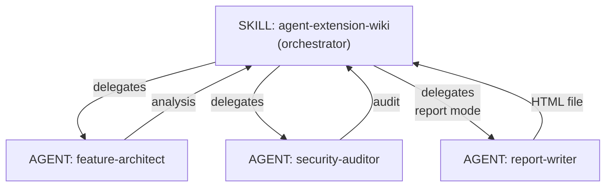

# Agent Extension Wiki

Analyze agent extensions (plugins, skills, commands, hooks, agents, MCP servers, rules) and generate self-contained HTML wiki reports with risk assessment and plugin profiles. Currently supports Claude Code plugins. Also supports inline markdown output.

## Features

- **Full Analysis**: Component inventory, architecture, security audit, usage guide, and quality checklist
- **Security Audit**: Permission model analysis, tool scope audit, hook script security, MCP trust boundaries
- **Architecture Review**: Design philosophy, component relationships with Mermaid diagrams, data flow, workflow sequence diagrams
- **HTML Wiki Report**: Self-contained HTML file with tabbed components, interactive pan+zoom diagrams, and Plugin Profile
- **Usage Guide Generation**: Auto-extracted triggers, arguments, prerequisites, install commands
- **Plugin Profile**: Component inventory, documentation checklist, security risk level, quality checklist

## Currently Supported Platforms

- **Claude Code** — Full analysis support

## Usage

### Analyze a local plugin (generates HTML report by default)

```
analyze ./plugins/my-plugin
```

### Analyze from GitHub

```
analyze github.com/owner/repo
```

### Inline markdown output

```
analyze ./plugins/my-plugin --format md
```

### Specify output language

```
analyze ./plugins/my-plugin --lang en
```

### Security audit only

```
security audit ./plugins/my-plugin
```

### Quick overview

```
overview ./plugins/my-plugin
```

### Report location

Reports are saved to `~/.claude/plugins/agent-extension-wiki/reports/`:
```
~/.claude/plugins/agent-extension-wiki/reports/{plugin-name}-report.html
```

## Analysis Modes

| Mode | Trigger | Output |
|------|---------|--------|
| `analyze` (default) | "analyze", "inspect", "report", "wiki", "document" | HTML (default) or inline markdown (`--format md`) |
| `security` | "security audit", "permission" | Inline markdown (security only) |
| `overview` | "overview", "summary" | Inline markdown (identity + inventory) |

## Architecture



## License

MIT
