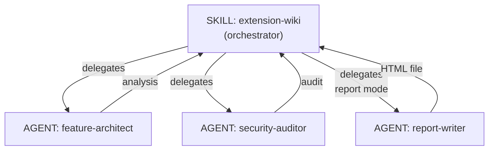

# Extension Wiki

Analyze Claude Code extensions (plugins, skills, commands, hooks, agents, MCP servers, rules) and generate visual reports with risk assessment and quality scores. Supports inline markdown output and self-contained HTML wiki reports.

## Features

- **Full Analysis**: 7-category evaluation with weighted scoring (A-F grades)
- **Security Audit**: Permission model analysis, tool scope audit, hook script security, MCP trust boundaries
- **Architecture Review**: Component relationships with Mermaid diagrams, data flow, state management
- **HTML Wiki Report**: Self-contained HTML file with interactive sections, visual score bars, and Mermaid diagram rendering
- **Usage Guide Generation**: Auto-extracted triggers, arguments, prerequisites, install commands
- **Visual Scoring**: Per-category scores with visual bars

## Usage

### Analyze a local plugin

```
analyze ./plugins/my-plugin
```

### Analyze from GitHub

```
analyze github.com/owner/repo
```

### Security audit only

```
security audit ./plugins/my-plugin
```

### Quick overview

```
overview ./plugins/my-plugin
```

### Generate HTML wiki report

```
wiki ./plugins/my-plugin
document ./plugins/my-plugin --lang ko
html report ./plugins/my-plugin --output ~/reports/my-plugin.html
```

## Analysis Modes

| Mode | Trigger | Output |
|------|---------|--------|
| `analyze` (default) | "analyze", "inspect", "report" | Inline markdown (full 7-category) |
| `security` | "security audit", "permission" | Inline markdown (security only) |
| `overview` | "overview", "summary" | Inline markdown (identity + inventory) |
| `report` | "wiki", "document", "html" | Self-contained HTML file |

## Architecture



## Scoring Categories

| Category | Weight |
|----------|--------|
| Identity & Overview | 5% |
| Functionality | 20% |
| Usage Guide | 10% |
| Dependencies | 10% |
| Security & Permissions | 30% |
| Architecture | 10% |
| Quality | 15% |

## License

MIT
