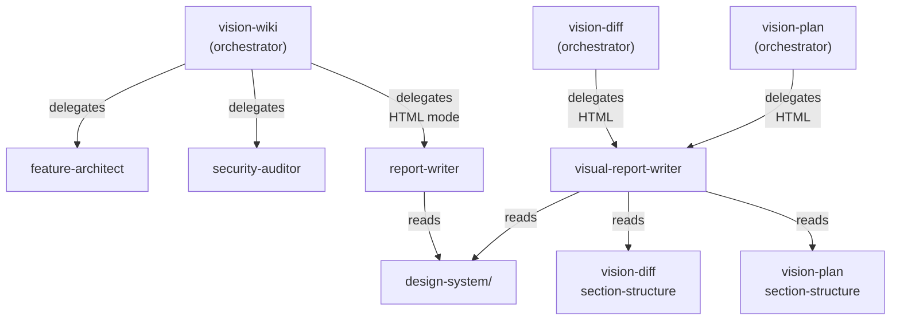

# Vision Powers

Visual report generation suite for Claude Code: plugin wiki analysis, git diff visualization, and implementation plan review. All outputs are self-contained interactive HTML reports with responsive navigation, Mermaid diagrams, Chart.js dashboards, and a curated design system.

## Skills

### vision-wiki

Analyze agent extensions (plugins, skills, commands, hooks, agents, MCP servers) and generate HTML wiki reports with security audit and plugin profiles.

```
analyze ./plugins/my-plugin
analyze github.com/owner/repo
analyze ./plugins/my-plugin --format md
security audit ./plugins/my-plugin
overview ./plugins/my-plugin
```

### vision-diff

Visualize git diffs as interactive HTML reports with architecture diagrams, KPI dashboards, code review cards, and side-by-side comparisons.

```
visualize diff HEAD
review changes on feature/auth
visualize PR #123
diff review abc1234
```

### vision-plan

Review implementation plans as interactive HTML reports with architecture diagrams, blast radius analysis, risk assessment, and gap detection.

```
review plan ~/.claude/plans/my-plan.md
evaluate plan ./docs/auth-redesign.md
```

## Report Location

All reports are saved to:
```
~/.claude-code-zero/vision-powers/reports/
```

## Architecture



### Shared Design System

All report generators share a modular design system (`references/design-system/`):

| File | Content |
|------|---------|
| `css-patterns.md` | Theme variables, depth tiers, cards, backgrounds, animations |
| `font-system.md` | 12 curated font pairings with rotation rules |
| `mermaid-patterns.md` | Mermaid theming, zoom controls, fullscreen |
| `navigation.md` | Responsive sidebar TOC + mobile horizontal bar |
| `libraries.md` | CDN references (Mermaid, Chart.js, Google Fonts) |
| `anti-slop-rules.md` | Forbidden patterns, approved aesthetics, quality checklist |

## License

MIT
